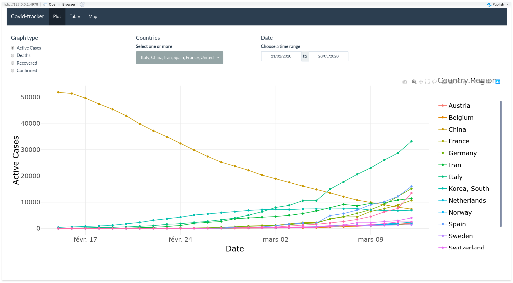
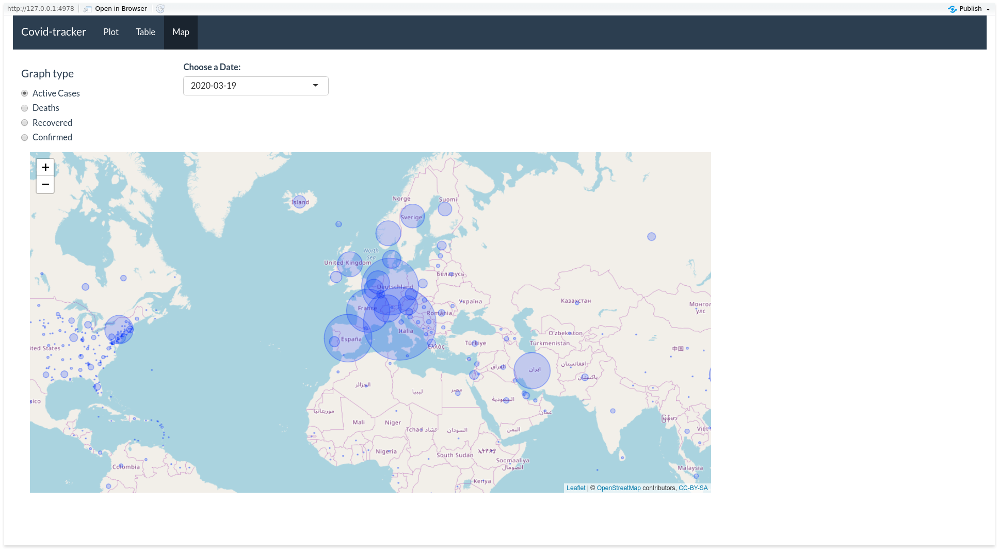

# covid-19-webapp

## Gallery

<a href="images/image1.png"></a>
<a href="images/image2.png"></a>

## Installation

### Run the app locally from source

- Install rstudio.
- Clone/Download the project on your computer.
- Open the .Rproj file with rstudio to load the R project.
- Open the app.R file.
- Click on the run app button.
- Wait for the dependencies to be installed (can take quite some time as the packages are compiled from source).
- The app should launch after that.

### Run the app locally with runGithub

In rstudio, run the following code :

```
options(Ncpus=4)
install.packages('shiny')
library('shiny')
runGitHub('covid-19-webapp', 'dbeley')
```
